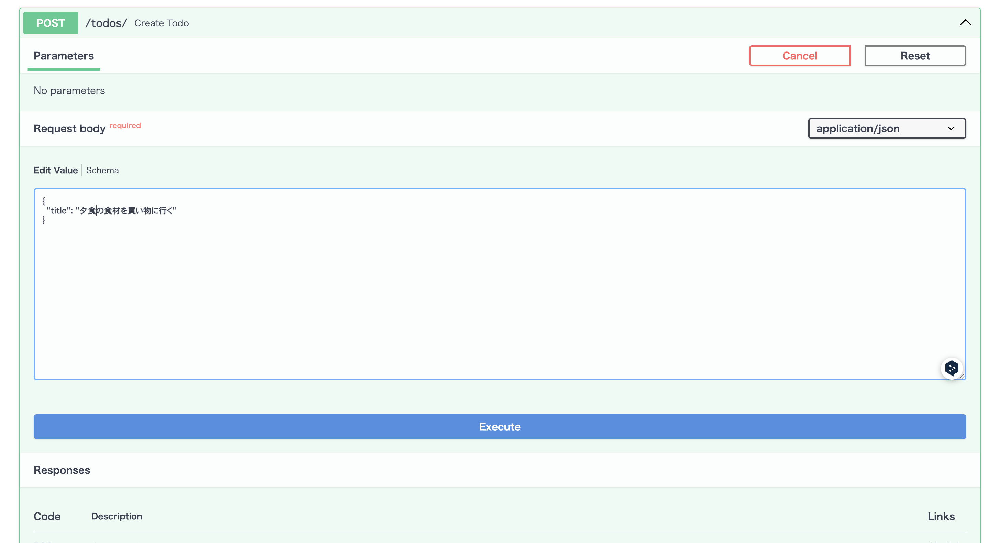

## このステップで学ぶこと

前のステップに続いて、今回はTodoの登録機能を作成します。  
APIを通じてデータベースに新しいTodoを追加できるようにしましょう。

## スキーマの作成

> 💡 **スキーマ**:  
> APIのリクエストとレスポンスのデータ形式を定義するクラスです。  
> データの検証(バリデーション)と変換に使われます。

まず、APIのリクエストとレスポンスの形式を定義します。  
`todo-api/app/schemas.py` を以下のように編集します:

```python
# todo-api/app/schemas.py

from pydantic import BaseModel

# 1. 基本となるTodoスキーマ
class TodoBase(BaseModel):
    title: str

# 2. Todo作成用のスキーマ
class TodoCreate(TodoBase):
    pass

# 3. Todoレスポンス用のスキーマ
class Todo(TodoBase):
    id: int
    completed: bool

    class Config:
        from_attributes = True
```

## コードの解説

1. **基本となるTodoスキーマ**

   ```python
   class TodoBase(BaseModel):
       title: str
   ```

   - すべてのTodoスキーマの基底クラスです
   - `title`フィールドは文字列型で必須です

2. **Todo作成用のスキーマ**

   ```python
   class TodoCreate(TodoBase):
       pass
   ```

   - 新しいTodoを作成する際に使用するスキーマです
   - 現在は`TodoBase`と同じですが、後で追加のフィールドを定義できます

3. **Todoレスポンス用のスキーマ**

   ```python
   class Todo(TodoBase):
       id: int
       completed: bool

       class Config:
           from_attributes = True
   ```

   - APIのレスポンスとして返すTodoの形式を定義します
   - `id`と`completed`フィールドを追加しています
   - `from_attributes = True`は前のステップで作成したモデルのオブジェクトからレスポンスに自動的に変換できるようにするための設定です
       - [pydantic: Arbitrary class instances](https://docs.pydantic.dev/latest/concepts/models/#arbitrary-class-instances)

## Todoの登録機能の作成

`todo-api/app/main.py` を以下のように更新してTodoの登録機能を作成します:

```diff lang=python
# todo-api/app/main.py

+from fastapi import FastAPI, Depends, HTTPException
+from sqlalchemy.orm import Session
+from . import models, schemas
+from .database import engine, get_db

models.Base.metadata.create_all(bind=engine)

app = FastAPI()

# Todo一覧の取得
@app.get("/todos")
def read_todos():
    return [
        {"id": 1, "title": "買い物に行く", "completed": False},
        {"id": 2, "title": "宿題をする", "completed": True}
    ]

+# Todoの作成
+@app.post("/todos/", response_model=schemas.Todo)
+def create_todo(todo: schemas.TodoCreate, db: Session = Depends(get_db)):
+    # 1. 新しいTodoインスタンスの作成
+    db_todo = models.Todo(title=todo.title)
+    
+    # 2. データベースに追加
+    db.add(db_todo)
+    
+    # 3. 変更を保存
+    db.commit()
+    
+    # 4. データベースから最新のデータを取得
+    db.refresh(db_todo)
+    
+    # 5. 作成したTodoを返す
+    return db_todo

```

## コードの解説

1. **新しいTodoインスタンスの作成**

   ```python
   db_todo = models.Todo(title=todo.title)
   ```

   - リクエストから受け取ったタイトルを使って新しいTodoを作成します

2. **データベースに追加**

   ```python
   db.add(db_todo)
   ```

   - 作成したTodoをデータベースセッションに追加します

3. **変更を保存**

   ```python
   db.commit()
   ```

   - データベースの変更を確定します

4. **データベースから最新のデータを取得**

   ```python
   db.refresh(db_todo)
   ```

   - データベースから最新のデータを取得して、Todoインスタンスを更新します

5. **作成したTodoを返す**

   ```python
   return db_todo
   ```

   - 作成したTodoをJSON形式で返します

## 🚀 動作確認

1. サーバーを再起動します:

   ```bash
   uvicorn app.main:app --reload
   ```

2. ブラウザで [http://localhost:8000/docs](http://localhost:8000/docs) を開きます。

3. 以下の操作を試してみましょう:
   1. POST /todos/ の "Try it out" をクリックします
   
   2. "Edit Value" の "title" に todo のタイトルを入力して "Execute" ボタンをクリックします
   
   3. "Server response" の "Code" 200 の "Response body" が表示されていればOKです
   

## 🎯 理解度チェック

以下の質問に答えて、学習内容を確認しましょう！

1. **FastAPIでPOSTリクエストを処理する際の正しい書き方は？**

   - A: `@app.post("/path")`
   - B: `@app.create("/path")`
   - C: `@app.add("/path")`

<details>
<summary>答えを見る</summary>

   **答え: A: `@app.post("/path")`**

   - POSTリクエストには`@app.post`を使用します
   - 参考: [FastAPI公式ドキュメント](https://fastapi.tiangolo.com/tutorial/first-steps/)
</details>

## 📝 まとめ

このステップでは以下について学びました。

- **スキーマの定義**

  - リクエストとレスポンスのスキーマの定義
  - データのバリデーションと変換

- **Todoの登録機能の作成**
  - データベースへの保存

--- 
