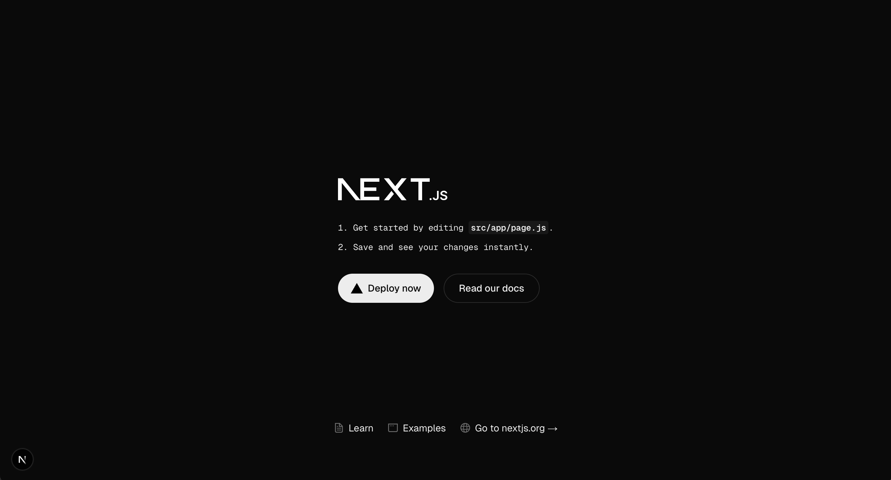

## このチュートリアルについて

このチュートリアルでは、Next.js を使ってTodo管理アプリを作成しながら、Web アプリケーション開発の基本を学んでいきます。

1. **環境構築**
2. **基本機能の実装**
3. **機能拡張**

## 前提知識

- HTML、CSS、JavaScript の基礎
- ターミナルの基本的な使い方

> 💡 **ターミナル**: パソコンに命令を送るための画面です。Windows では「コマンドプロンプト」や「PowerShell」、Mac では「ターミナル」と呼ばれます。

## 事前準備

このチュートリアルを進めるにはお使いのパソコンに [Node.js](https://nodejs.org/ja) がインストールされている必要があります。
以下のコマンドを実行して Node.js がインストールされているか確認してください:

> 💡 **コマンド**: 「フォルダを作る」「ファイルを開く」など、パソコンに対する命令のことです。

```bash
node --version
npm --version
```

以下のようにバージョンが表示されれば OK です:

```
v22.16.0
10.9.2
```

(環境によってバージョン番号が異なる可能性がありますが問題ありません)

Node.js がインストールされていない場合は、[公式サイト](https://nodejs.org/)からダウンロードしてください（LTS 版を推奨）。

## Next.js プロジェクトの作成

> 💡 プロジェクト  
> 家を建てるときには建築現場に必要な道具や材料、設計図などを整理して置きますよね。  
> Next.js のプロジェクトも同じようなものです。  
> ウェブアプリの開発に必要なものが整理されて入っている「箱」のようなものです。

ターミナルで以下のコマンドを実行してください:

```bash
npx create-next-app@latest todo-manager
```

いくつか質問が表示されます:

```
Would you like to use TypeScript? No / Yes
Would you like to use ESLint? No / Yes
Would you like to use Tailwind CSS? No / Yes
Would you like your code inside a `src/` directory? No / Yes
Would you like to use App Router? (recommended) No / Yes
Would you like to use Turbopack for `next dev`?  No / Yes
Would you like to customize the import alias (`@/*` by default)? No / Yes
```

以下のように回答してください:

```
Would you like to use TypeScript? No / Yes
→ No を選択
  理由: TypeScript は高度な機能なので、最初はシンプルな JavaScript で覚えましょう

Would you like to use ESLint? No / Yes
→ No を選択
  理由: Next.js の学習に集中するため

Would you like to use Tailwind CSS? No / Yes
→ No を選択
  理由: CSSの基本から学習するため

Would you like to use `src/` directory? No / Yes
→ Yes を選択

Would you like to use App Router? (recommended) No / Yes
→ Yes を選択
  理由: 最新の推奨方式のため

Would you like to use Turbopack for `next dev`?  No / Yes
→ No を選択
  理由: Next.js の学習に集中するため

Would you like to customize the default import alias (@/*)? No / Yes
→ No を選択
  理由: デフォルトのままで十分
```

セットアップが完了したら、プロジェクトフォルダに移動して開発サーバーを起動します:

```bash
cd todo-manager
npm run dev
```

以下のような出力が表示されれば成功です:

```
> todo-manager@0.1.0 dev
> next dev

   ▲ Next.js 15.3.2
   - Local:        http://localhost:3000
   - Environments: .env.local

 ✓ Starting...
 ✓ Ready in 2.1s
```

ブラウザで `http://localhost:3000` を開くと、Next.js の初期画面が表示されます。



ターミナルに `Ctrl + C` を入力すると開発サーバーを停止できます（Mac, Windows 共通）。

## プロジェクト構造の理解

作成されたプロジェクトの構造を詳しく見ていきましょう：

```
todo-manager/
├── .next/             # Next.js が自動生成するビルドファイル（編集不要）
├── node_modules/      # インストールしたパッケージが保存されるフォルダ（編集不要）
├── README.md          # プロジェクトの説明書
├── jsconfig.json      # JavaScript の設定ファイル
├── next.config.mjs    # Next.js の設定ファイル
├── package-lock.json  # パッケージのバージョン管理ファイル（編集不要）
├── package.json       # プロジェクトの設定や使用するパッケージの情報
├── public/            # 画像などの静的ファイルを置くフォルダ
└── src/               # ソースコードを格納するフォルダ
    └── app/           # アプリケーションのメインフォルダ
        ├── favicon.ico    # ブラウザのタブに表示される小さなアイコン
        ├── globals.css    # 全ページ共通のスタイルを定義するCSSファイル
        ├── layout.js      # 全ページ共通のレイアウト (ヘッダーやフッターなど)
        ├── page.js        # トップページ(`/`)に表示する内容を書くファイル
        └── page.module.css # トップページ専用の CSS ファイル
```

**各ファイルとフォルダの役割を詳しく説明します：**

1. **.next フォルダ**

   - Next.js が自動的に生成するフォルダです
   - ビルド（プログラムの変換）結果が保存されます
   - このフォルダは編集する必要はありません

2. **node_modules フォルダ**

   - インストールしたパッケージ（追加の機能）が保存されるフォルダです
   - このフォルダは通常編集しません

3. **README.md**

   - プロジェクトの説明書です
   - プロジェクトの概要や使い方などを記述します
   - Markdown 形式で書かれています

4. **jsconfig.json**

   - JavaScript の設定ファイルです
   - エディタの補完機能などを改善するために使います
   - 最初はデフォルトの設定のままで問題ありません

5. **next.config.mjs**

   - Next.js の設定を変更するためのファイルです
   - 画像の最適化や、その他の機能を設定できます
   - 最初はデフォルトの設定のままで問題ありません

6. **package-lock.json**

   - パッケージのバージョンを正確に管理するファイルです
   - 自動的に更新されるので、手動で編集する必要はありません

7. **package.json**

   - プロジェクトの設定情報が書かれているファイルです
   - 使用するパッケージの一覧や、実行できるコマンドが定義されています
   - プロジェクトの名前やバージョンなども設定できます

8. **public フォルダ**

   - 画像やアイコンなど、静的なファイルを置く場所です
   - このフォルダ内のファイルは、そのまま URL でアクセスできます
   - サンプルとして、いくつかの SVG 画像が含まれています

9. **src フォルダ**

   - アプリケーションのソースコード（プログラム）を格納する場所です
   - コードを整理して管理しやすくするために使います

10. **app フォルダ**
    - Next.js のアプリケーションの中心となるフォルダです
    - appフォルダの中に作ったのフォルダの名前がページの URL になります
    - 例：`src/app/users/page.js` → `http://localhost:3000/users` をブラウザで開くと `page.js` の内容が表示されます

> 💡 **ヒント**:
>
> - 最初は `src/app/page.js` と `src/app/page.module.css` を編集するだけで簡単な変更ができます
> - 開発サーバの実行中にファイルを編集して保存すると、変更内容がブラウザに自動的に反映されます（ホットリロード機能）
> - `.next` と `node_modules` フォルダは編集しないでください
> - `public` フォルダには、画像などの静的なファイルを置きます
> - 他のファイルは、必要に応じて徐々に理解していきましょう

## よくある問題と解決方法

**コマンドを打ち間違えた場合**

- 間違えたコマンドを入力した場合は、`Ctrl + C` でキャンセルできます

**ポートが使用中の場合**

- 別のアプリケーションが 3000 番ポートを使用している場合、自動的に 3001 番などに変更されます
- ターミナルに表示される URL を確認してください
- 例：`http://localhost:3001` のように表示された場合は、その URL を開いてください

**コマンドが見つからない場合**

- エラーメッセージ例：`'npx' は内部コマンドまたは外部コマンドとして認識されていません`
- 解決方法：
  1. Node.js が正しくインストールされているか確認
  2. パソコンを再起動してみる
  3. Node.js を再インストールする

**権限エラーが発生する場合**

- エラーメッセージ例：`Permission denied` や `アクセスが拒否されました`
- 解決方法：
  - Mac: Node.js を再インストールする（`sudo` は使わない）
  - Windows: 管理者として実行する必要がある場合があります

**フォルダ名やパスに日本語が含まれている場合**

- エラーが発生する可能性があります
- フォルダ名は英語（アルファベット）のみを使用することをお勧めします
- 例：`Todo管理` → `todo-manager`

## 🔍 確認

正しく動作するか確認してみましょう：

import ChecklistItem from '../../../components/ChecklistItem.jsx';

<div>
  <ChecklistItem client:load id="point3">
    `npm run dev` で開発サーバーを起動できる
  </ChecklistItem>
  <ChecklistItem client:load id="point4">
    初期画面(`http://localhost:3000/`)を表示できる
  </ChecklistItem>
</div>

## 🎯 理解度チェック

以下の質問に答えて、学習内容を確認しましょう！

1. **Next.js プロジェクトを作成するコマンドは？**

   - A: `npm create-next-app@latest todo-manager`
   - B: `npx create-next-app@latest todo-manager`
   - C: `next create-app@latest todo-manager`

   <details>
   <summary>答えを見る</summary>

   **答え: B: `npx create-next-app`**
   - `npx` は Node.js のパッケージを実行するためのコマンドです
   - `create-next-app` は Next.js のプロジェクトを作成するためのツールです
   - `@latest` は `create-next-app` の最新のバージョンを使うという意味です
   - `todo-manager` はプロジェクトの名前です. `create-next-app` はこの名前で新しいフォルダを作成します
   </details>

## 📝 まとめ

このステップでは以下について学びました。

- **環境構築**
  - Node.jsのインストール確認方法
  - `node --version`と`npm --version`でバージョン確認
  - `npx create-next-app`コマンドでプロジェクト作成

- **プロジェクト構造**
  - `.next/`: ビルドファイル（編集不要）
  - `node_modules/`: パッケージ保存（編集不要）
  - `public/`: 静的ファイル（画像など）
  - `src/app/`: メインのソースコード
  - その他の設定ファイル（package.json, next.config.mjsなど）

- **開発の基本**
  - `npm run dev`で開発サーバー起動
  - ホットリロード機能（ファイル保存で自動更新）
  - ローカルサーバー（`http://localhost:3000`）で確認

- **トラブルシューティング**
  - ポートが競合したときの対応方法
  - 権限エラーの対処法
  - 日本語パス名の注意点
  - 開発サーバーの停止方法（Ctrl+C / Cmd+C）
