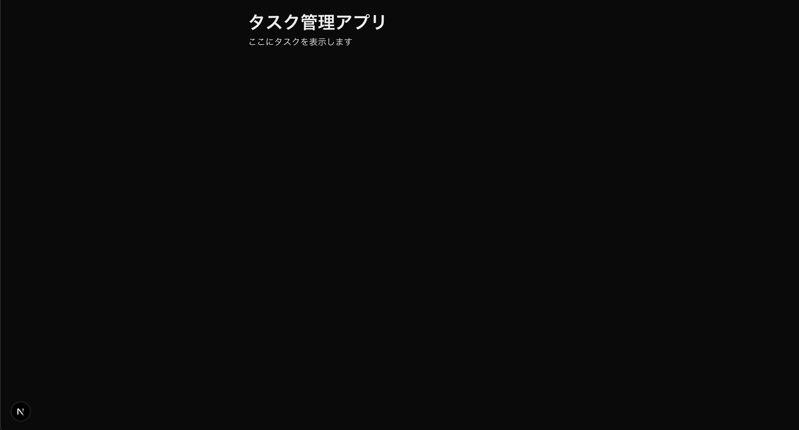

## このステップで学ぶこと

前のステップに続いて、今回は実際にページを作成していきます。シンプルな内容から始めて少しずつ機能を追加していきましょう。

1. **トップページの編集**
2. **基本的な JSX の書き方**
3. **ブラウザの自動更新機能の確認**

> 💡 **JSX**: JavaScript の中で HTML のような記法を使って UI を記述する方法です。例えば `<div>` や `<h1>` などの HTML タグを JavaScript の中で直接使うことができます。

## シンプルなトップページを作る

`src/app/page.js` を開いてファイルの中に書かれているものをすべて削除してください。  
次に以下の内容を貼り付けてください。

```javascript
// src/app/page.js

// 1. コンポーネントの定義
export default function Home() {
  return (
    // 2. 画面の見た目の定義（HTMLのような記法で記述）
    <div>
      <h1>はじめてのTodoアプリ</h1>
      <p>やることリストを簡単に管理できます</p>
      <button>始める</button>
    </div>
  );
}
```

## コードの解説

1. **コンポーネントの定義**

   ```javascript
   export default function Home() {
     return (
       <div>
         <h1>はじめてのTodoアプリ</h1>
         <p>やることリストを簡単に管理できます</p>
         <button>始める</button>
       </div>
     );
   }
   ```

   - コンポーネントとは画面の部品のことです。  
   コンポーネントを組み合わせてレゴブロックのように画面を構築します。  
   部品は何度でも使うことができます。  
   例えば、以下のように書くことができます:

     ```javascript
     <div>
       <Home />
       <Home />
       <Home />
     </div>
     ```

     - より詳しく知りたい人は [React の公式ドキュメント](https://ja.react.dev/learn) を参照してください
   - `Home` はコンポーネントの名前です。コンポーネントの名前は**必ず大文字で始める**必要があります

2. **画面の見た目の定義**

   ```javascript
   <div>
     <h1>はじめてのTodoアプリ</h1>
     <p>やることリストを簡単に管理できます</p>
     <button>始める</button>
   </div>
   ```

   - JSX を使って UI を記述しています
   - `<div>` や `<h1>` などの HTML タグを使って、ページの構造を作ります
   - `<button>` タグを使って、アプリページへのリンクボタンを追加しています

## 🚀 動作確認

1. ファイルを保存すると、ブラウザが自動的に更新されます（ホットリロード機能）
2. `http://localhost:3000` にアクセスして、変更が反映されているか確認してください



## よくある問題と解決方法

**変更が反映されない**

- 変更した内容を保存しているか確認する
- 開発サーバーが正常に動作しているか確認する
- ブラウザを手動で更新（F5キー(Windows), cmd+R(Mac)）してみる

**エラーが表示される**

- コードの書き方が正しいか確認
- 中括弧 `{}` や括弧 `()` の閉じ忘れがないか確認
- セミコロン `;` の付け忘れがないか確認

## 🔍 確認

実装した機能が正しく動作しているか確認しましょう：

import ChecklistItem from '../../../components/ChecklistItem.jsx';

<div>
  <ChecklistItem client:load id="step2-point3">
    トップページに「はじめてのTodoアプリ」というタイトルが表示されている
  </ChecklistItem>
  <ChecklistItem client:load id="step2-point4">
    トップページに「やることリストを簡単に管理できます」という説明文が表示されている
  </ChecklistItem>
  <ChecklistItem client:load id="step2-point5">
    「始める」ボタンが表示されている
  </ChecklistItem>
</div>

## 🎯 理解度チェック

以下の質問に答えて、学習内容を確認しましょう！

1. **JSX で HTML タグを書く際の注意点は？**

   - A: タグは必ず小文字から始まる（例：`<div>`）
   - B: タグは必ず大文字から始まる（例：`<Div>`）
   - C: タグは JavaScript の構文で書く

<details>
<summary>答えを見る</summary>

   **答え: A: タグは必ず小文字から始まる（例：`<div>`）**

   - JSX では、通常の HTML タグ（`<div>`、`<h1>` など）は HTML と同じように書きます
   - 自分でコンポーネントを作る場合は（このステップでは使用しません）必ず大文字から始めなければいけません
   - 参考: [React DOM コンポーネント](https://ja.react.dev/reference/react-dom/components)
</details>

## 📝 まとめ

このステップでは以下について学びました。

- **JSX の基本**

  - HTML のような記法で UI を記述
  - コンポーネントの定義方法

- **開発の基本**

  - ファイルの編集方法
  - ホットリロード機能の確認
  - エラーの確認と修正方法

- **トラブルシューティング**
  - 変更が反映されない場合の対処法
  - エラーが出たときに対処方法

---
