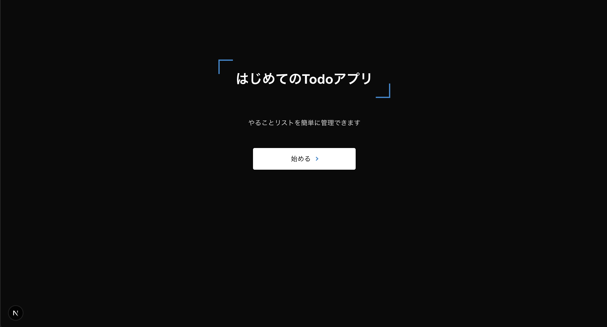

## このステップで学ぶこと

```javascript
// src/app/page.module.css

/* 
 * 出典：CSS Stock
 * URL: https://pote-chil.com/css-stock/ja/
 * 一部カスタマイズして使用
 */

.container {
  display: flex;
  flex-direction: column;
  align-items: center;
  gap: 3rem;
  padding: 30px;
  padding-top: 10%;
}

.heading {
  position: relative;
  padding: 0.7em 1.3em;
  color: #ffffff;
}

.heading::before,
.heading::after {
  display: inline-block;
  position: absolute;
  width: 1em;
  height: 1em;
  content: '';
}

.heading::before {
  top: 0;
  left: 0;
  border-top: 3px solid #2589d0;
  border-left: 3px solid #2589d0;
}

.heading::after {
  bottom: 0;
  right: 0;
  border-bottom: 3px solid #2589d0;
  border-right: 3px solid #2589d0;
}

.button {
  display: flex;
  justify-content: center;
  align-items: center;
  width: 250px;
  margin: 0 auto;
  padding: 0.9em 2em;
  border: 1px solid black;
  border-radius: 5px;
  background-color: #fff;
  color: black;
  font-size: 1em;
}

.button::after {
  transform: rotate(45deg);
  width: 5px;
  height: 5px;
  margin-left: 10px;
  border-top: 2px solid #2589d0;
  border-right: 2px solid #2589d0;
  content: '';
}

```

```javascript
// src/app/page.js

import style from './page.module.css';

export default function Home() {
  return (
    <div className={style.container}>
      <h1 className={style.heading}>はじめてのTodoアプリ</h1>
      <p className={style.box}>やることリストを簡単に管理できます</p>
      <button className={style.button}>始める</button>
    </div>
  );
}
```

## 🚀 動作確認

1. ファイルを保存すると、ブラウザが自動的に更新されます（ホットリロード機能）
2. `http://localhost:3000` にアクセスして、変更が反映されているか確認してください


