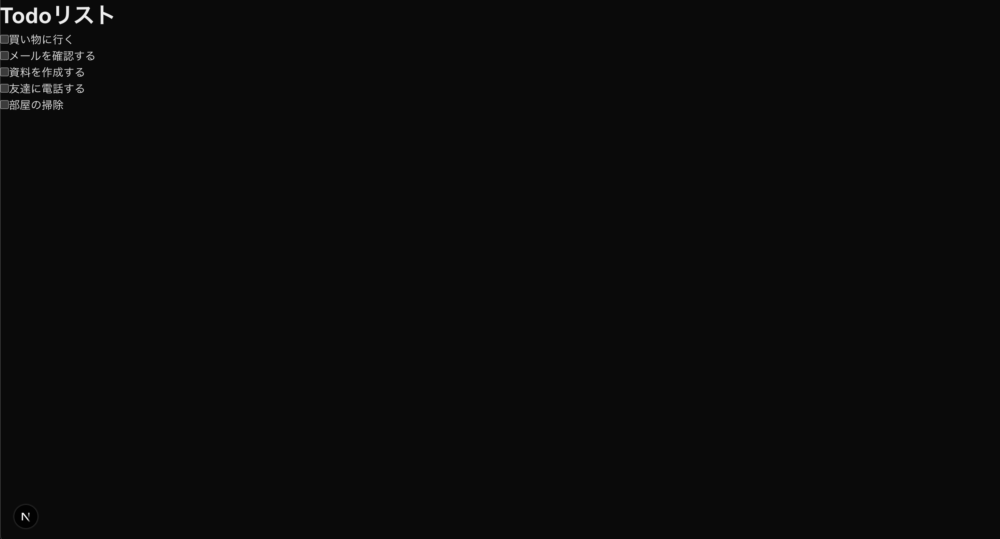

## このステップで学ぶこと

前回はトップページのスタイリングを行いました。  
今回はTodoリストを表示するメインページの追加とページ間をリンクさせる方法について学びます。

1. **新しいページの作成方法**
2. **ページ間のリンク機能**

## メインページの実装

まず、`src/app/todos`ディレクトリを作成し、その中に`page.js`ファイルを作成しましょう。  
作成した`page.js`に以下のコードを貼り付けましょう。

```javascript
// src/app/todos/page.js

export default function Todos() {
  return (
    <section>
      <h1>Todoリスト</h1>
      <div>
        <label>
          <input type="checkbox" />
          買い物に行く
        </label>
        <label>
          <input type="checkbox" />
          メールを確認する
        </label>
        <label>
          <input type="checkbox" />
          資料を作成する
        </label>
        <label>
          <input type="checkbox" />
          友達に電話する
        </label>
        <label>
          <input type="checkbox" />
          部屋の掃除
        </label>
      </div>
    </section>
  );
}
```

## 🚀 動作確認(ページの追加)

`http://localhost:3000/todos` にアクセスして、変更が反映されているか確認してください。  
以下のように表示されていればOKです。



## メインページのスタイリング

次にTodoリストのスタイルを整えましょう。  
`src/app/todos/page.module.css`ファイルを作成し、以下の内容を追加します：

```css
.container {
  max-width: 800px;
  margin: 0 auto;
  padding: 2rem;
}

.checkbox {
  display: flex;
  flex-direction: column;
  gap: 1rem;
}

.checkbox label {
  display: flex;
  align-items: center;
  gap: 0.5rem;
  font-size: 1.1rem;
}

.checkbox input[type="checkbox"] {
  width: 1.2rem;
  height: 1.2rem;
}
```

そして、`page.js`を以下のように更新します：

```javascript
// src/app/todos/page.js

import style from './page.module.css';

export default function Todos() {
  return (
    <section className={style.container}>
      <h1>Todoリスト</h1>
      <div className={style.checkbox}>
        <label>
          <input type="checkbox" />
          買い物に行く
        </label>
        <label>
          <input type="checkbox" />
          メールを確認する
        </label>
        <label>
          <input type="checkbox" />
          資料を作成する
        </label>
        <label>
          <input type="checkbox" />
          友達に電話する
        </label>
        <label>
          <input type="checkbox" />
          部屋の掃除
        </label>
      </div>
    </section>
  );
}
```

## ページ間のリンク

トップページからメインページへのリンクを追加しましょう。  
`src/app/page.js`を以下のように更新します：

```javascript
// src/app/page.js

import style from './page.module.css';
import Link from 'next/link';

export default function Home() {
  return (
    <div className={style.container}>
      <h1 className={style.heading}>はじめてのTodoアプリ</h1>
      <p className={style.box}>やることリストを簡単に管理できます</p>
      <Link href="/todos">
        <button className={style.button}>始める</button>
      </Link>
    </div>
  );
}
```

## 🔍 確認

実装した機能が正しく動作しているか確認しましょう：

import ChecklistItem from '../../../components/ChecklistItem.jsx';

<div>
  <ChecklistItem client:load id="step4-point1">
    トップページの「始める」ボタンをクリックするとメインページ(`/todos`)が表示される
  </ChecklistItem>
  <ChecklistItem client:load id="step4-point2">
    メインページの「トップへ戻る」をクリックするとトップページ(`/`)が表示される
  </ChecklistItem>
</div>

## よくある問題と解決方法

**リンクが機能しない**

- `Link`コンポーネントが正しくインポートされているか確認
- `href`属性のパスが正しいか確認

**スタイルが適用されない**

- CSSモジュールのインポートが正しいか確認
- クラス名の指定が正しいか確認
- ファイル名が`.module.css`で終わっているか確認

## ここまでの作業の解説

ここまでで、新しいページの追加とページ間のリンクを実装しました。  
この実装の背景にある重要な概念を説明します。

### ルーティング

ルーティングとは、WebアプリケーションでURLに応じて適切なページを表示する仕組みのことです。

> 💡 **URLのパス**: URLの中で、ドメイン名の後ろに続く部分のことです。  
> 例えば、`http://localhost:3000/todos`の場合、`/todos`がパスです。  
> パスは`/`（スラッシュ）で始まり、その後に続く文字列でページを区別します。

この章では以下のようなルーティングを設定しました：
- `http://localhost:3000/` → トップページ（`app/page.js`）
- `http://localhost:3000/todos` → Todoリストページ（`app/todos/page.js`）

このように、URLのパス（`/`や`/todos`など）に応じて、表示するページを切り替える必要があります。

### ファイルベースルーティング

Webアプリケーションでルーティングを実装する方法はいくつかありますが、Next.jsでは「ファイルベースルーティング」という方式を採用しています。

> 💡 **ファイルベースルーティング**: フォルダとファイルの配置を使ってルーティングを定義する方式です。  
> フォルダとファイルの配置がそのままURLのパスになります。  
> この章では、`app/todos/page.js`というファイルを作成することで、`/todos`というURLでアクセスできるようになりました。

この方式のメリット：
- 直感的：ファイルの場所がそのままURLになる
- シンプル：特別な設定ファイルが不要

### Next.jsのファイルベースルーティングの仕組み

Next.jsのファイルベースルーティングについて詳しく説明します：

1. **基本的なルール**
   - `app`フォルダの中に作ったフォルダとファイルがURLのパスになります
   - `page.js`というファイル名のファイルが、そのフォルダのページになります
   - この章で実装した例：
     - `app/page.js` → `/`（トップページ）
     - `app/todos/page.js` → `/todos`（Todoリストページ）

2. **動的ルーティング**
   - `[id]`のような角括弧で囲まれたフォルダ名は動的なパラメータになります
   - 例：`app/todos/[id]/page.js` → `/todos/1`, `/todos/2`など

> 💡 **動的**: 「動的」とは、URLの一部が固定ではなく、様々な値を受け取れることを意味します。例えば、`/todos/1`や`/todos/2`のように、IDをパスに含めることで各Todoにユニークなパスを表現できます。

> 💡 **動的ルーティングのパラメータ**: 動的ルーティングで受け取ったパラメータは、`page.js`の中で以下のように取得できます。  
> ```javascript
> // app/todos/[id]/page.js
> export default function TodoDetail({ params }) {
>   // params.id でURLのパラメータを取得できます（例：/todos/1 の場合、params.id は "1"）
>   return <div>Todo ID: {params.id}</div>
> }
> ```

## 🎯 理解度チェック

以下の質問に答えて、学習内容を確認しましょう！

1. **Next.jsでページ間のリンクを作成する際に使用するコンポーネントは？**

   - A: `<a>`
   - B: `<Link>`
   - C: `<Route>`
   - D: `<Navigate>`

<details>
<summary>答えを見る</summary>

   **答え: B: `<Link>`**

   - Next.jsでは、ページ間のクライアントサイドナビゲーションを実現するために`Link`コンポーネントを使用します
   - 通常の`<a>`タグと異なり、ページの完全なリロードを避け、必要な部分のみを更新することができます
</details>

2. **Next.jsのファイルベースルーティングで、`src/app/todos/page.js`はどのURLに対応しますか？**

   - A: `/`
   - B: `/todos`
   - C: `/page`
   - D: `/todos/page`

<details>
<summary>答えを見る</summary>

   **答え: B: `/todos`**

   - ファイルベースルーティングでは、`src/app`フォルダの中のファイル構造がそのままURLのパスになります
   - `page.js`は`/todos`にアクセスしたときに表示されるページを定義します
</details>

3. **動的ルーティングで、`src/app/todos/[id]/page.js`の`[id]`は何を表しますか？**

   - A: 決まった値
   - B: 自由に変えられる値
   - C: データベースのID
   - D: ページ番号

<details>
<summary>答えを見る</summary>

   **答え: B: 自由に変えられる値**

   - `[id]`は`/todos/1`や`/todos/2`のように、URLの一部として自由に値を変えられます
   - この値は`page.js`の中で`params.id`として取得できます
</details>

## 📝 まとめ

このステップでは、以下の内容を学びました：

- ページ間のリンクの作成方法
  - `Link`コンポーネントを使って、ページ間を移動できます
- ファイルベースルーティングの仕組み
  - `src/app`フォルダの中のファイル構造がURLのパスになります
  - `page.js`はそのパスにアクセスしたときに表示されるページを定義します
- 動的ルーティングの基本的な使い方
  - `[id]`のような角括弧で囲まれたフォルダ名で、自由に値を変えられるパスを作れます
  - この値は`page.js`の中で`params.id`として取得できます

次のステップでは、Todoリストの機能を実装していきます。

---
