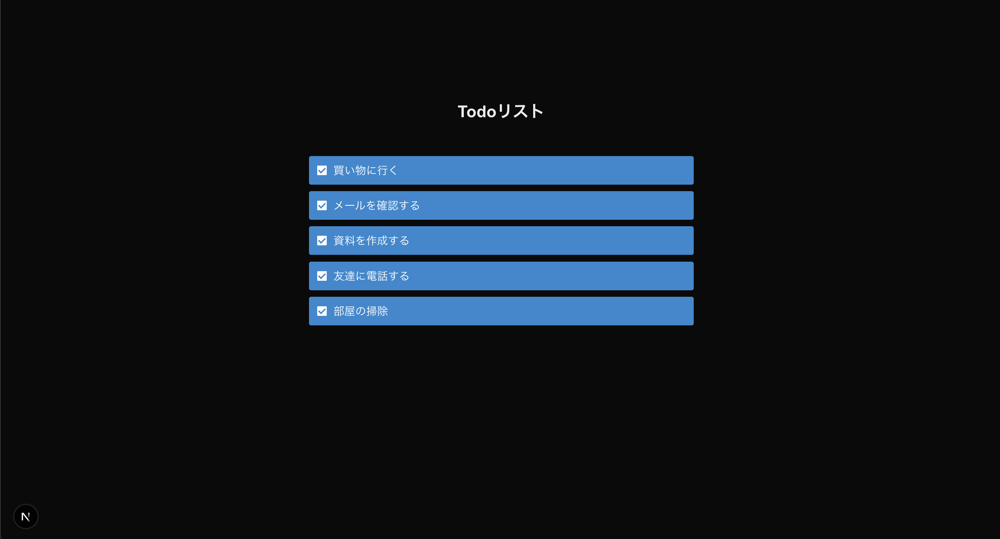

## このステップで学ぶこと

前回はトップページのスタイリングを行いました。  
今回はTodoリストを表示するメインページの追加とページ間をリンクさせる方法について学びます。

1. **新しいページを追加する方法**
2. **ページ間のリンク機能**

## メインページの実装

まず、`src/app/todos`フォルダを作成し、その中に`page.js`ファイルを作成しましょう。  
作成した`page.js`に以下のコードを貼り付けましょう。

```javascript
// src/app/todos/page.js

export default function Todos() {
  return (
    <section>
      <h1>Todoリスト</h1>
      <div>
        <div>
          <label>
            <input type="checkbox" />
            買い物に行く
          </label>
        </div>
        <div>
          <label>
            <input type="checkbox" />
            メールを確認する
          </label>
        </div>
        <div>
          <label>
            <input type="checkbox" />
            資料を作成する
          </label>
        </div>
        <div>
          <label>
            <input type="checkbox" />
            友達に電話する
          </label>
        </div>
        <div>
          <label>
            <input type="checkbox" />
            部屋の掃除
          </label>
        </div>
      </div>
    </section>
  );
}

```

## 🚀 動作確認(ページの追加)

`http://localhost:3000/todos` にアクセスして、変更が反映されているか確認してください。  
以下のように表示されていればOKです。


## メインページのスタイリング

次にTodoリストのスタイルを整えましょう。  
`src/app/todos/page.module.css`ファイルを作成し、以下の内容を追加します:

```css
// src/app/todos/page.module.css

/*
 * 出典：CSS Stock
 * URL: https://pote-chil.com/css-stock/ja/
 * 一部カスタマイズして使用
 */

.container {
  display: flex;
  flex-direction: column;
  align-items: center;
  gap: 3rem;
  padding: 30px;
  padding-top: 10%;
}

.checkbox {
  width: 40%;
  border: none;
}

.checkbox label {
  width: 100%;
  display: flex;
  align-items: center;
  gap: 0 0.6em;
  position: relative;
  margin-bottom: 0.6em;
  padding: 0.5em 0.7em;
  border: 1px solid #2589d0;
  border-radius: 3px;
  background-color: #2589d026;
  cursor: pointer;
}

.checkbox label:has(:checked) {
  background-color: #2589d0;
  color: #fff;
}

.checkbox label::before {
  width: 14px;
  height: 14px;
  border-radius: 1px;
  background-color: #fff;
  content: '';
}

.checkbox label:has(:checked)::after {
  position: absolute;
  top: 14px;
  left: 15px;
  transform: rotate(45deg);
  width: 4px;
  height: 8px;
  border: solid #2589d0;
  border-width: 0 2px 2px 0;
  content: '';
}

.checkbox input {
  display: none;
}

```

そして、`page.js`を以下のように更新します:

```diff lang="jsx"
// src/app/todos/page.js

+import style from './page.module.css';

export default function Todos() {
  return (
+    <section className={style.container}>
      <h1>Todoリスト</h1>
+      <div className={style.checkbox}>
        <div>
          <label>
            <input type="checkbox" />
            買い物に行く
          </label>
        </div>
        <div>
          <label>
            <input type="checkbox" />
            メールを確認する
          </label>
        </div>
        <div>
          <label>
            <input type="checkbox" />
            資料を作成する
          </label>
        </div>
        <div>
          <label>
            <input type="checkbox" />
            友達に電話する
          </label>
        </div>
        <div>
          <label>
            <input type="checkbox" />
            部屋の掃除
          </label>
        </div>
      </div>
    </section>
  );
}

```

## 🚀 動作確認(スタイリング)

以下のように表示されていればOKです。



## ページ間のリンク

まずはトップページからメインページへのリンクを追加しましょう。  
`src/app/page.js`を以下のように更新します：

```diff lang="jsx"
// src/app/page.js

import style from './page.module.css';
+import Link from 'next/link';

export default function Home() {
  return (
    <div className={style.container}>
      <h1 className={style.heading}>はじめてのTodoアプリ</h1>
      <p className={style.box}>やることリストを簡単に管理できます</p>
+      <Link href="/todos">
        <button className={style.button}>始める</button>
+      </Link>
    </div>
  );
}
```

次にメインページからトップページへのリンクを作りましょう。

```diff lang="jsx"
// src/app/todos/page.js

import style from './page.module.css';
+import Link from 'next/link';

export default function Todos() {
  return (
    <section className={style.container}>
      <h1>Todoリスト</h1>
      <div className={style.checkbox}>
        <div>
          <label>
            <input type="checkbox" />
            買い物に行く
          </label>
        </div>
        <div>
          <label>
            <input type="checkbox" />
            メールを確認する
          </label>
        </div>
        <div>
          <label>
            <input type="checkbox" />
            資料を作成する
          </label>
        </div>
        <div>
          <label>
            <input type="checkbox" />
            友達に電話する
          </label>
        </div>
        <div>
          <label>
            <input type="checkbox" />
            部屋の掃除
          </label>
        </div>
      </div>
+      <Link href="/">トップへ戻る</Link>
    </section>
  );
}
```

これでトップページからメインページ、メインからトップページに移動できるようになりました 🎉

## 🚀 動作確認(リンク)

実装した機能が正しく動作しているか確認しましょう:

- トップページの「始める」ボタンをクリックするとメインページ(`/todos`)が表示される
- メインページの「トップへ戻る」をクリックするとトップページ(`/`)が表示される

## よくある問題と解決方法

**ページが表示されない**
- フォルダ名が間違っていないか確認する
- ブラウザに入力したパスが間違っていないか確認する
- フォルダの中に`page.js`があるか確認する

**リンクが機能しない**

- `Link`コンポーネントが正しくインポートされているか確認する
- `href`属性のパスが正しいか確認する

**スタイルが適用されない**

- CSSモジュールのインポートが正しいか確認する
- CSSクラス名が正しいか確認する
- ファイル名の末尾が`.module.css`になっているか確認する

## 解説

メインページを追加し、トップページとメインページにリンクを作成しました。  
この背景にある重要な概念を説明します。

### ルーティング

Webアプリケーションでパスに応じて適切なページを表示する仕組みをルーティングと呼びます。

> 💡 **パス**: URLの中で、ドメイン名の後ろに続く部分のことです。  
> 例えば、`http://localhost:3000/todos`の場合、`/todos`がパスです。  
> パスは`/`（スラッシュ）で始まり、その後に続く文字列でページを区別します。

この章では以下のようなルーティングを設定しました:
- `http://localhost:3000/` → トップページ（`app/page.js`）
- `http://localhost:3000/todos` → Todoリストページ（`app/todos/page.js`）

このようにパス（`/`や`/todos`など）に応じて適切なページが表示されるようになっています。

### ファイルベースルーティング

ルーティングの実現の仕方はいくつかありますが、Next.jsでは「ファイルベースルーティング」という方式が採用されています。

> 💡 **ファイルベースルーティング**:  
> フォルダの配置を使ってルーティングを定義する方式です。  
> フォルダの配置がそのままパスになります。  
> `app/todos/page.js`というファイルを作成することで、`/todos`というパスにアクセスできるようになります。

### Next.jsのルーティングのルール

Next.js のルーティングにはいくつかルールがあります。

   - `src/app`の中に作ったフォルダ階層がパスになります
   - `page.js`に作成した内容がブラウザに表示されます
   - この章で実装したページ:
     - `app/page.js` → `/`（トップページ）
     - `app/todos/page.js` → `/todos`（Todoリストページ）
   - `[id]`のような角括弧で囲まれたフォルダ名は動的なパラメータになります（動的ルーティング）
   - 例：`app/todos/[id]/page.js` → `/todos/1`, `/todos/2`など

> 💡 **動的**: 「動的」とは、URLの一部が固定ではなく、様々な値を受け取れることを意味します。例えば、`/todos/1`や`/todos/2`のように、IDをパスに含めることで各Todoにユニークなパスを表現できます。

> 💡 **動的ルーティングのパラメータ**: 動的ルーティングで受け取ったパラメータは、`page.js`の中で以下のように取得できます。  
> ```javascript
> // app/todos/[id]/page.js
> export default function TodoDetail({ params }) {
>   // params.id でURLのパラメータを取得できます（例：/todos/1 の場合、params.id は "1"）
>   return <div>Todo ID: {params.id}</div>
> }
> ```

## 🎯 理解度チェック

以下の質問に答えて、学習内容を確認しましょう！

1. **Next.jsでページ間のリンクを作成する際に使用するコンポーネントは？**

   - A: `<a>`
   - B: `<Link>`
   - C: `<Route>`
   - D: `<Navigate>`

<details>
<summary>答えを見る</summary>

   **答え: B: `<Link>`**

   - Next.jsでは、ページ間のクライアントサイドナビゲーションを実現するために`Link`コンポーネントを使用します
   - 通常の`<a>`タグと異なり、ページの完全なリロードを避け、必要な部分のみを更新することができます
</details>

2. **`src/app/todos/page.js`はどのパスに対応しますか？**

   - A: `/`
   - B: `/todos`
   - C: `/page`
   - D: `/todos/page`

<details>
<summary>答えを見る</summary>

   **答え: B: `/todos`**

   - Next.jsのルーティングでは、`src/app`フォルダの中のファイル構造がそのままパスになります
   - `page.js`は`/todos`にアクセスしたときに表示されるページを定義します
</details>

3. **動的ルーティングで、`src/app/todos/[id]/page.js`の`[id]`は何を表しますか？**

   - A: 決まった値
   - B: 自由に変えられる値
   - C: データベースのID
   - D: ページ番号

<details>
<summary>答えを見る</summary>

   **答え: B: 自由に変えられる値**

   - `[id]`は`/todos/1`や`/todos/2`のように、URLの一部として自由に値を変えられます
   - この値は`page.js`の中で`params.id`として取得できます
</details>

## 📝 まとめ

このステップでは、以下の内容を学びました：

- ページ間のリンクの作成方法
  - `Link`コンポーネントを使って、ページ間を移動できます
- ファイルベースルーティングの仕組み
  - `src/app`フォルダの中のフォルダ階層構造がURLのパスになります
  - `page.js`はそのパスにアクセスしたときに表示されるページを定義します
- 動的ルーティングの基本的な使い方
  - `[id]`のような角括弧で囲まれたフォルダ名で、自由に値を変えられるパスを作れます
  - この値は`page.js`の中で`params.id`として取得できます

次のステップでは、Todoリストの機能を実装していきます。

---
