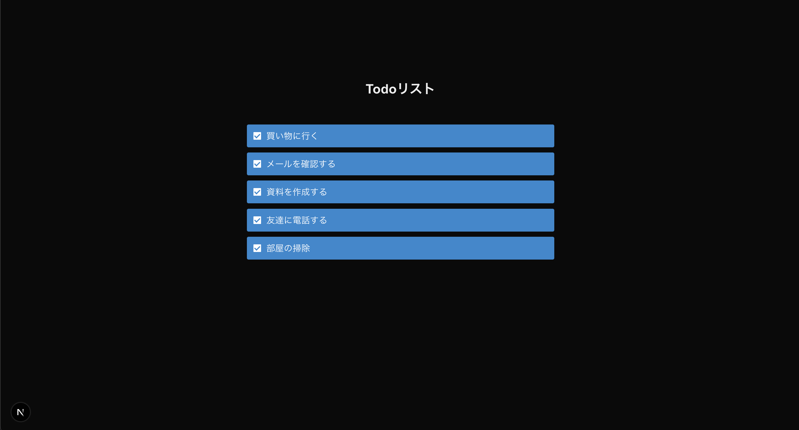

## このステップで学ぶこと

前回はページを追加する方法やページ同士をリンクする方法について学びました。  
今回は配列に格納されているデータからページを組み立てる方法を学びましょう。

1. **配列データの表示方法**
2. **`map()`を使った繰り返し処理**

> 💡 **ヒント**:  
> Webアプリケーションではユーザーや状況などによって表示する内容が変わるのが一般的です。  
> このステップでは状況に応じて表示内容を変える方法について学びます。

## Todo表示機能の実装

まずは配列に格納されたデータをページに表示する方法について学びましょう。  
`src/app/todos/page.js` を以下の内容に変えます。

```diff lang="jsx"
// src/app/todos/page.js

+ // 1. コードをブラウザ上で実行させる
+ "use client"

import style from './page.module.css';

export default function Todos() {
+  // 2. Todoデータの定義
+  const todos = [
+    { id: 1, title: '買い物に行く', completed: false },
+    { id: 2, title: 'メールを確認する', completed: false },
+    { id: 3, title: '資料を作成する', completed: false },
+    { id: 4, title: '友達に電話する', completed: false },
+    { id: 5, title: '部屋の掃除', completed: false },
+  ];

  return (
    <section className={style.container}>
      <h1>Todoリスト</h1>
      <div className={style.checkbox}>
-        <div>
-          <label>
-            <input type="checkbox" />
-            買い物に行く
-          </label>
-        </div>
-        <div>
-          <label>
-            <input type="checkbox" />
-            メールを確認する
-          </label>
-        </div>
-        <div>
-          <label>
-            <input type="checkbox" />
-            資料を作成する
-          </label>
-        </div>
-        <div>
-          <label>
-            <input type="checkbox" />
-            友達に電話する
-          </label>
-        </div>
-        <div>
-          <label>
-            <input type="checkbox" />
-            部屋の掃除
-          </label>
-        </div>
+        { /* 3. map() によるTodoの表示 */}
+        {todos.map((todo) => (
+          <div key={todo.id}>
+            <label>
+              <input type="checkbox" checked={todo.completed} onChange={(e) => { console.log(e.target.checked)}} />
+              {todo.title}
+            </label>
+          </div>
+        ))}
      </div>
      <Link href="/">トップへ戻る</Link>
    </section>
  );
}
```

## コードの解説

1. **コードをブラウザ上で実行させる**
  - このファイルに書いたコードをブラウザ上で実行するようにNext.jsに指示します
  - "use client" を書かない場合はサーバとクライアントの両方で実行される可能性があります
  - サーバ上で`onChange`に関数を設定するとエラーになるため、この指定が必要です
  - 参考: ['use client'](https://ja.react.dev/reference/rsc/use-client)
2. **Todoデータの定義**
   ```javascript
   const todos = [
     { id: 1, title: '買い物に行く', completed: false },
     { id: 2, title: 'メールを確認する', completed: false },
     { id: 3, title: '資料を作成する', completed: false },
     { id: 4, title: '友達に電話する', completed: false },
     { id: 5, title: '部屋の掃除', completed: false },
   ];
   ```
   - `todos` 配列に、各Todoの情報を格納
   - 各Todoは `id`、`title`、`completed` の3つのプロパティを持つオブジェクト
   - `id` は一意の識別子として使用
   - `completed` はTodoの完了状態を表す真偽値

3. **map() によるTodoの表示**
   ```javascript
   {todos.map((todo) => (
     <div>
       <label key={todo.id}>
         <input type="checkbox" checked={todo.completed} onChange={(e) => { console.log(e.target.checked)}} />
         {todo.title}
       </label>
     </div>
   ))}
   ```
   - `todos.map()` で各Todoを処理
   - `key={todo.id}` で各要素に一意の識別子を付与
   - `checked` に true を設定するとチェックボックスにチェックマークが表示されます
   - `onChange` はチェックボックスがクリックされたときに実行する処理を書きます
       - ここではブラウザのコンソールにチェックボックスがチェックされているかどうかを表す値を表示しています

## よくある問題と解決方法

**Todoが表示されない場合**
- `todos` 配列が正しく定義されているか確認
- `map()` の構文が正しいか確認
- コンソールにエラーが表示されていないか確認

**key の警告が表示される場合**
- 各Todoに一意の `id` が設定されているか確認
- `key` プロパティが正しく設定されているか確認

## 🚀 動作確認

step4と同じように表示されていればOKです。



## 🎯 理解度チェック

以下の質問に答えて、学習内容を確認しましょう！

1. **配列の各要素を処理して新しい配列を作成するメソッドは？**

   - A: `forEach()`
   - B: `map()`
   - C: `filter()`
   - D: `reduce()`

<details>
<summary>答えを見る</summary>

   **答え: B: `map()`**

   - `map()` は配列の各要素に対して処理を行い、新しい配列を作成します
   - このステップでは、Todoデータを HTML 要素の配列に変換するために使用しています
</details>

2. **React でリストを表示する際に必要な属性は？**

   - A: `id`
   - B: `key`
   - C: `name`
   - D: `index`

<details>
<summary>答えを見る</summary>

   **答え: B: `key`**

   - `key` は各要素を一意に識別するために必要な属性です
   - React が効率的に DOM を更新するために使用されます
</details>

## 📝 まとめ

このステップでは以下について学びました。

- **配列データの表示方法**
  - 配列データの定義と管理
  - 条件に応じた表示の切り替え
- `map()` を使った繰り返し処理
  - `key` 属性に一意の識別子を設定する

---
