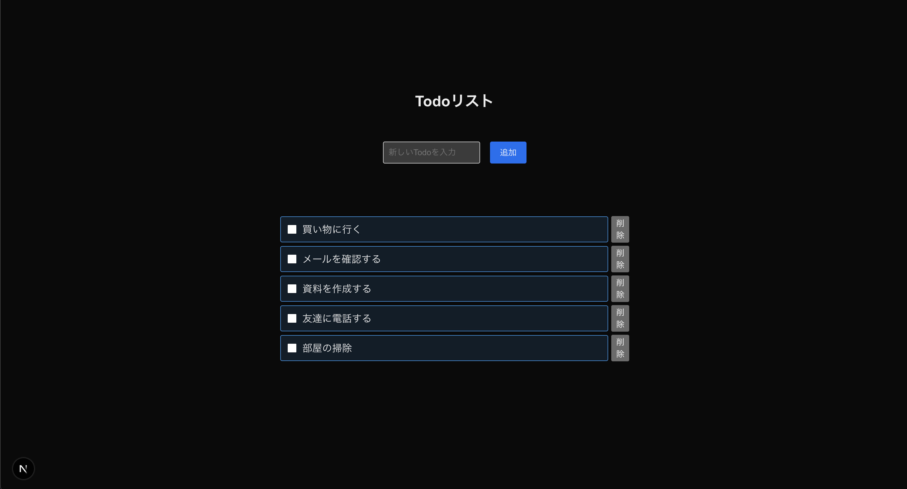

## このステップで学ぶこと

前回はTodoの完了状態を更新する機能を作成しました。  
今回はTodoを削除する機能を作っていきましょう。

## Todo削除機能の作成

`src/app/todos/page.js` を以下の内容に更新します。

```diff lang=jsx
'use client';
import { useState } from 'react';
import style from './page.module.css';

export default function Todos() {
  // Todoデータの定義
  const [todos, setTodos] = useState([
    { id: 1, title: '買い物に行く', completed: false },
    { id: 2, title: 'メールを確認する', completed: false },
    { id: 3, title: '資料を作成する', completed: false },
    { id: 4, title: '友達に電話する', completed: false },
    { id: 5, title: '部屋の掃除', completed: false },
  ]);

  // 入力値の状態管理
  const [newTodo, setNewTodo] = useState('');

  // Todo追加処理
  const handleSubmit = (e) => {
    e.preventDefault();
    if (newTodo.trim() === '') return;

    const newId = todos.length > 0 ? Math.max(...todos.map(t => t.id)) + 1 : 1;
    setTodos([...todos, { id: newId, title: newTodo, completed: false }]);
    setNewTodo('');
  };

  // Todoの完了状態を更新する処理
  const handleToggleComplete = (todoId) => {
    setTodos(todos.map(todo =>
      todo.id === todoId
        ? { ...todo, completed: !todo.completed }
        : todo
    ));
  };

+  // 1. Todoを削除する処理
+  const handleDelete = (todoId) => {
+    if (window.confirm('このTodoを削除しますか？')) {
+      setTodos(todos.filter(todo => todo.id !== todoId));
+    }
+  };

  return (
    <section className={style.container}>
      <h1>Todoリスト</h1>

      {/* Todo追加フォーム */}
      <form onSubmit={handleSubmit} className={style.form}>
        <input
          type="text"
          value={newTodo}
          onChange={(e) => setNewTodo(e.target.value)}
          placeholder="新しいTodoを入力"
          className={style.input}
        />
        <button type="submit" className={style.button}>追加</button>
      </form>

      {/* Todo一覧 */}
      <div className={style.checkbox}>
        {todos.map(todo => (
+          <div key={todo.id} className={style.todoItem}>
            <label className={todo.completed ? style.completed : ''}>
              <input
                type="checkbox"
                checked={todo.completed}
                onChange={() => handleToggleComplete(todo.id)}
              />
              {todo.title}
            </label>
+            <button onClick={() => handleDelete(todo.id)}>
+              削除
+            </button>
          </div>
        ))}
      </div>
    </section>
  );
}
```

### コードの説明

1. **Todoを削除する処理**
   ```javascript
   const handleDelete = (todoId) => {
     if (window.confirm('このTodoを削除しますか？')) {
       setTodos(todos.filter(todo => todo.id !== todoId));
     }
   };
   ```
   - `window.confirm()`: 削除する前に確認ダイアログを表示します
   - `todos.filter(todo => todo.id !== todoId)`: 元の配列から削除するTodoを除いた配列を作ります
   - `setTodos()`: 更新されたTodo一覧を保存します

## スタイルの更新

`src/app/todos/page.module.css` に以下のスタイルを追加します。

```diff lang=css
/* src/app/todos/page.module.css */

.checkbox label {
  width: 100%;
  display: flex;
  align-items: center;
  gap: 0 0.6em;
  position: relative;
-  margin-bottom: 0.6em;
  padding: 0.5em 0.7em;
  border: 1px solid #2589d0;
  border-radius: 3px;
  background-color: #2589d026;
  cursor: pointer;
}

/* 省略 */

.completed {
  text-decoration: line-through;
  color: #888;
}

+.todoItem {
+  display: flex;
+  gap: 5px;
+  justify-content: space-between;
+  align-items: center;
+  margin-top: 5px;
+  width: 100%;
+}
```

## 🚀 動作確認

正しく動作しているか確認しましょう。



- 削除ボタンをクリックすると確認ダイアログが表示される
- 確認後にTodoが削除される
- キャンセルした場合はTodoが削除されない

## よくある問題と解決方法

**Todoを削除できない**
- `handleDelete` 関数が呼び出されているか確認する
- `filter` メソッドの条件が間違っていないか確認する

## 🎯 理解度チェック

以下の質問に答えて、学習内容を確認しましょう！

1. **配列から条件に一致する要素だけを取り出したいときに使う関数は？**

   - A: `forEach()`
   - B: `map()`
   - C: `filter()`
   - D: `reduce()`

<details>
<summary>答えを見る</summary>

   **答え: C: `filter()`**
   - `filter()` は条件に合う要素だけを抽出して新しい配列を作成します
   - このステップでは、特定のID以外のTodoを抽出するために使いました
</details>

2. **確認ダイアログを表示するために使用するメソッドは？**

   - A: `window.alert()`
   - B: `window.prompt()`
   - C: `window.confirm()`
   - D: `window.dialog()`

<details>
<summary>答えを見る</summary>

   **答え: C: `window.confirm()`**
   - `window.confirm()` はユーザーに確認を求めるダイアログを表示します
   - このステップでは、Todoの削除前に確認を取るために使いました
</details>

## 📝 まとめ

このステップでは以下について学びました。

- **データの削除**
  - 配列からの要素の削除
  - `filter` メソッドの使用
  - 確認ダイアログの表示
